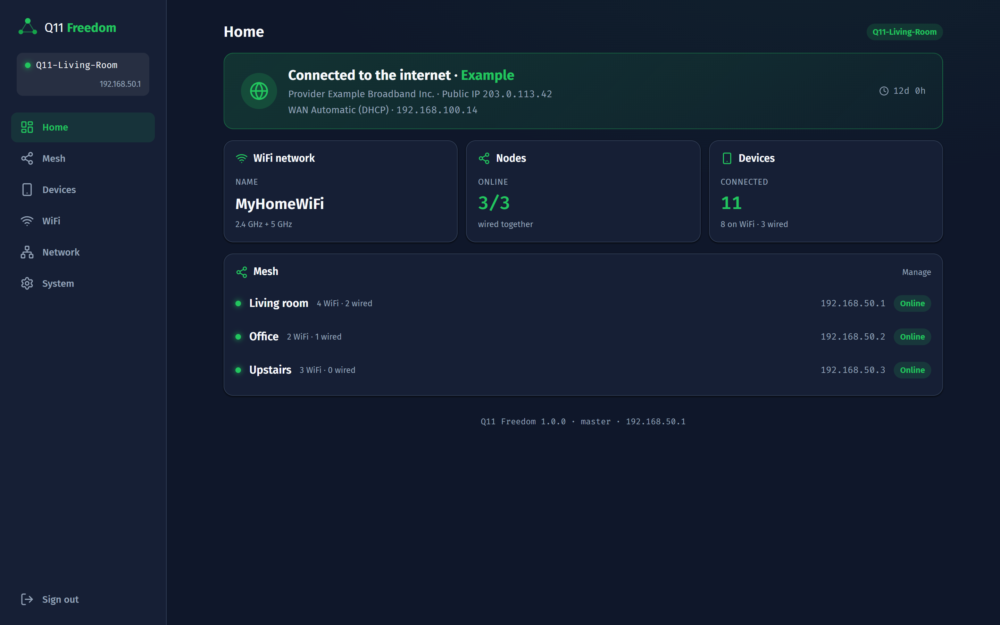
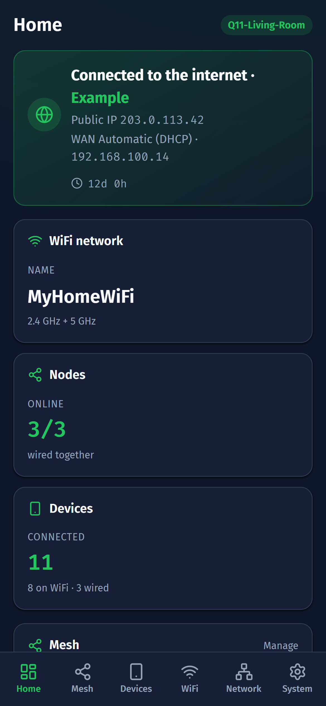
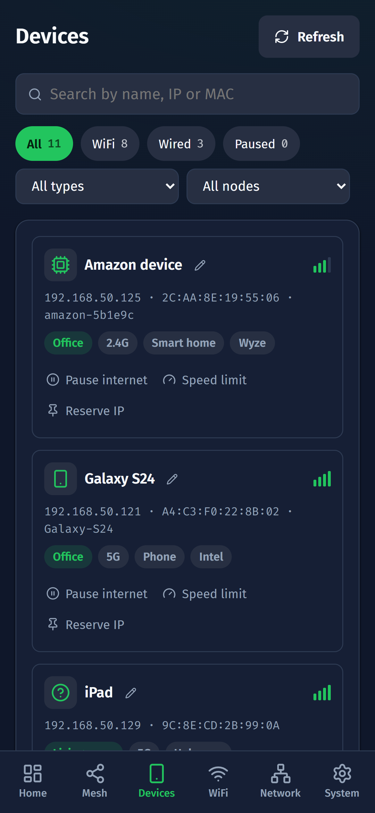
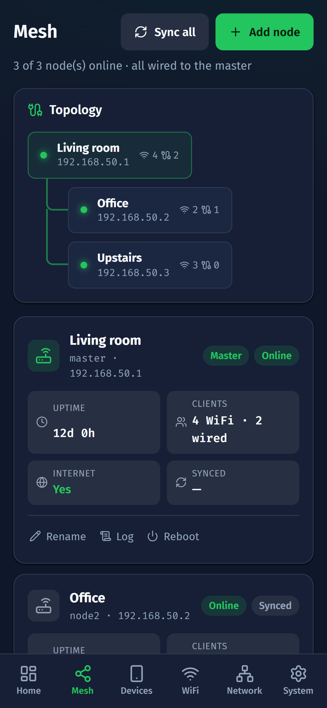
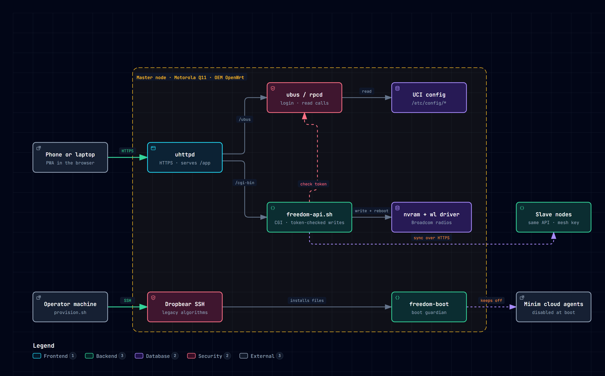

# Q11 Freedom

Take back control of your **Motorola Q11** mesh WiFi (MH7601, MH7602, MH7603)
after the Minim / MotoSync cloud went dark. Q11 Freedom turns each unit into a
self-managed router with its own local web panel: no account, no app store app
and no cloud.

**[Try the live demo](https://ramirezjhulian7.github.io/motorola-q11-freedom/)** in your browser. It runs with fictional data
and any password logs in.



> Screenshots come from the built-in demo mode. Every device, address and
> provider shown is fictional.

---

## Why this exists

The Motorola-branded home networking line, including the Q11 mesh, was built
and operated by Minim under license. The only way to manage these units was the
cloud-backed **motosync** app. In August 2022 Minim reported more than 100,000
home networks managed through that app. In July 2023 Motorola ended the license,
Minim ran out of money, and the app lost access to its cloud.

The routers kept broadcasting WiFi, but owners could no longer rename the
network, change the password, add a node or bring a unit back after a factory
reset. Q11 Freedom restores all of that locally, on the hardware you already own.

## What you get

- **Home**: internet status, provider, WAN details and a summary of the mesh.
- **Mesh**: topology, per-node status, add a node, sync, reboot and remove nodes.
- **Devices**: every client with the physical node it is connected to, connection type
  (2.4 GHz, 5 GHz or wired), signal, vendor guessed from the MAC prefix and a custom name.
- **Per-device controls**: pause internet, download speed limit and IP reservation.
- **WiFi**: network name, password and channel per band, with a QR code to share the network.
- **Network**: WAN (DHCP, static IP or PPPoE), LAN and DHCP pool.
- **System**: admin password (copied to every node), logs and reboot.
- **Status LED**: solid green with internet, solid red without it.
- **Installable PWA** on your phone, served over HTTPS by the router itself.

<p>
  
  
  
</p>

## Before you start

**Q11 Freedom never flashes firmware, and you should not either.** The Q11 is a
Broadcom BCM6756 device with closed WiFi drivers and no upstream OpenWrt port.
Guides that treat it as a Qualcomm router and run `sysupgrade` will brick it.
Q11 Freedom only adds files to the stock OEM OpenWrt overlay and changes
settings through `uci` and `nvram`, so a factory reset always returns the unit
to its original state. Details in [docs/HARDWARE.md](docs/HARDWARE.md).

| Supported | Notes |
|---|---|
| Motorola Q11 kits: MH7601, MH7602, MH7603 | Verified on stock firmware OpenWrt 2.0.1.390 |
| Other Minim-era Motorola devices | Not tested. The approach may apply, the scripts may not. |

You need:

- A computer with `bash`, `node` 20.19+ (or 22.12+) and `npm`, and `sshpass`.
  - macOS: `brew install hudochenkov/sshpass/sshpass`
  - Debian, Ubuntu or Windows through WSL: `sudo apt install sshpass`
- The root password printed on the label of each unit.
- A cable to a LAN port of the unit you are provisioning (recommended).

---

## Quick start

### 1. Open SSH on the unit (manual, once per unit)

Stock units ship with SSH closed. Minim left an admin route in the firmware
that starts it. This step needs a browser and cannot be scripted.

1. Connect to the unit by cable (or to its factory WiFi). Its address is
   usually `192.168.1.1`.
2. Open `https://192.168.1.1/cgi-bin/luci/admin/minim/web_admin`, accept the
   self-signed certificate and log in as `root` with the label password.
3. Open `https://192.168.1.1/cgi-bin/luci/admin/minim/start_sshd`. The page
   shows an error. That is expected: SSH is now running.

### 2. Back up the unit

```bash
bash scripts/backup-node.sh 192.168.1.1 '<label-password>' master-unit
```

Backups contain `/etc/shadow` and SSH host keys. They are written to
`backups/`, which is git-ignored. Keep them private.

### 3. Provision the master

```bash
bash scripts/provision.sh 192.168.1.1 '<label-password>' --role master --lan-ip 192.168.50.1
```

The script runs six steps and is safe to re-run on a node that is already
provisioned:

```
[1/6] Verifying SSH...
[2/6] Disabling Minim/MotoSync...
[3/6] Hardening (unauthenticated CGIs + ttyd)...
[4/6] Installing router scripts...
[4b] Ensuring HTTPS certificate...
[5/6] Deploying the Q11 Freedom web app...
[6/6] Applying role 'master'...
```

Changing the LAN address drops your connection. Reconnect and continue at the
new address.

### 4. Open the panel

Go to `https://192.168.50.1/app/` and log in as `root`. If the password is still
the one on the label, change it from **System**. The panel walks you through
the remaining first steps: naming your WiFi and adding nodes.

### 5. Add more units (slaves)

Repeat steps 1 and 2 on each extra unit, then provision it as a slave with the
next free address:

```bash
bash scripts/provision.sh 192.168.1.1 '<label-password>' --role slave --lan-ip 192.168.50.2
```

Connect the slave by cable from any LAN port of the master (or a switch behind
it), then open **Mesh > Add node** in the panel. The master adopts it, copies
the WiFi name, password and admin password, and from then on manages it.

Slaves run with DHCP off and STP on: the master is the only DHCP and DNS
server of the mesh, and every unit broadcasts the same network so devices roam
between them. An experimental wireless backhaul (WET) exists for units that
cannot be cabled; see [docs/HARDWARE.md](docs/HARDWARE.md#wireless-backhaul).

---

## Try the panel without a router

The quickest way is the [live demo](https://ramirezjhulian7.github.io/motorola-q11-freedom/), a static build of the same panel
served by GitHub Pages. Any password logs in, and nothing you change is saved.

The frontend also ships with a demo mode that answers every API call with
fictional data. It is the easiest way to work on the UI.

```bash
cd frontend
npm install
npm run demo        # http://localhost:5173/app/  (any password logs in)
```

To develop against a real unit, run `npm run dev`. Vite proxies `/ubus` and
`/cgi-bin` to `http://192.168.50.1`, or to the address in `VITE_ROUTER`.

---

## How it works



Interactive version with light and dark themes: open
[docs/architecture/architecture.html](docs/architecture/architecture.html) in a
browser. Source: [docs/architecture/architecture.json](docs/architecture/architecture.json).

- **uhttpd**, the stock web server, serves the panel from `/www/app` over HTTPS
  with a certificate generated for the node address.
- **Reads** go straight to the firmware's native `ubus` JSON-RPC API. Login uses
  `session.login`, so there is no extra user database to maintain.
- **Writes** go to `freedom-api.sh`, a small POSIX shell CGI. It validates the
  `ubus` session token on every request and checks every parameter against
  strict patterns before touching the system. The `ubus` HTTP ACLs on this
  firmware only allow reads, which is why the CGI exists.
- **WiFi changes** are written to `nvram` and applied with a reboot. On this
  proprietary Broadcom driver it is the only reliable path; `uci` changes and
  `wifi reload` are ignored.
- **Mesh sync**: the master calls the same API on each slave over HTTPS with a
  shared mesh key, pushing the WiFi name, password and admin password.
- **freedom-boot** runs on every boot. It keeps the Minim agents and the
  unauthenticated `ttyd` shell off, keeps the web server up and re-applies the
  node role, so a power cut never reverts the unit to cloud mode.

The full API contract is in [docs/API.md](docs/API.md).

## Everyday tasks

| Task | Command |
|---|---|
| Update only the web app | `bash scripts/deploy-spa.sh <ip> <password>` |
| Update only the router scripts | `bash scripts/deploy-router-files.sh <ip> <password>` |
| Re-provision or upgrade a node | `bash scripts/provision.sh <ip> <password> --role <master\|slave> --lan-ip <ip>` |
| Back up a node | `bash scripts/backup-node.sh <ip> <password> [label]` |
| Refresh the MAC vendor database | `python scripts/gen-oui.py` |

## Repository layout

```
docs/
  HARDWARE.md             What the hardware really is and every verified finding
  OPERATIONS.md           Persistence, factory reset, recovery, backups
  API.md                  Router API reference
  architecture/           Architecture diagram (JSON source, interactive HTML, PNG)
  screenshots/            Panel screenshots from demo mode

scripts/                  Run on your computer
  provision.sh            Provision a node from a stock unit (orchestrator)
  deploy-spa.sh           Build the web app and upload it to /www/app
  deploy-router-files.sh  Upload the API, init scripts and helpers
  backup-node.sh          Download a node's configuration
  gen-oui.py              Build the MAC vendor table used by the UI
  lib/ssh-common.sh       SSH helpers with the legacy algorithms the unit needs

router-files/             Installed on the router
  freedom-api.sh          Authenticated write API (CGI)
  freedom-boot.init       Boot guardian
  freedom-role.sh         Applies the master or slave role
  freedom-fw.sh           Pause internet per MAC (iptables)
  freedom-qos.sh/.init    Per-device speed limit (tc htb)
  freedom-led.sh/.init    Internet status LED
  freedom-names.hotplug   Remembers DHCP host names across reboots
  freedom-wet.sh/.init    Optional wireless backhaul (experimental)

frontend/                 React + Vite PWA, built to small static files
  demo/                   Mock router used by `npm run demo`
```

## Security model

- The panel requires the router's root login. Sessions are native `ubus`
  tokens that expire after 300 seconds without use.
- Every write request is authenticated by the CGI; an invalid or expired token
  gets `401`.
- Provisioning removes the factory CGIs that ran without authentication and
  disables the `ttyd` web shell.
- Node-to-node calls use HTTPS and a mesh key that only the master and its
  slaves know.
- The Minim admin route used in step 1 stays in the stock firmware. It still
  requires the root password, so change the label password after provisioning.

## Undoing everything

A factory reset (hold the reset button) erases the overlay and returns the unit
to its stock firmware, factory WiFi name and label password. Nothing that Q11
Freedom does touches the bootloader, the firmware partitions or the WiFi
calibration data. To free the unit again, repeat the quick start. See
[docs/OPERATIONS.md](docs/OPERATIONS.md).

## Credits

This project builds on earlier community work:

- [jabeg/motorola-q11-openwrt](https://github.com/jabeg/motorola-q11-openwrt): the first
  deploy scripts, the idea of disabling Minim and the WET bridge helper.
- [energy-x/Motorola-MH7601](https://github.com/energy-x/Motorola-MH7601): the SSH access
  method through the Minim admin route, and partition dumps for reference.

## Contributing

Issues and pull requests are welcome, especially reports from other Minim-era
Motorola models. Please never attach backups, `/etc/shadow`, keys or your real
WiFi credentials to an issue. See [CONTRIBUTING.md](CONTRIBUTING.md).

## If it helped you

Two things make it easier for the next owner with a Q11 in a drawer:

- **Tell us it worked.** Post your model and firmware version under
  [Discussions > It worked on my Q11](https://github.com/ramirezjhulian7/motorola-q11-freedom/discussions/categories/it-worked-on-my-q11).
  Every confirmed unit makes the supported list more trustworthy.
- **Star the repo.** Stars are how other owners find this in GitHub search.

## Disclaimer

Q11 Freedom is an independent community project. It is not affiliated with,
endorsed by or supported by Motorola, Lenovo, Minim or Premier LogiTech.
"Motorola" and product names are trademarks of their respective owners and are
used only to identify compatible hardware. You modify your own devices at your
own risk.

## License

[MIT](LICENSE)
